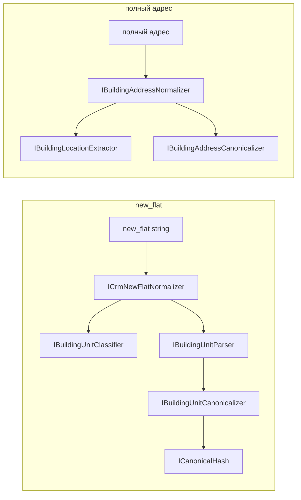

# VTBL.AddressNormalizer

Нормализация адресных данных CRM:

1. **BuildingUnit** — локация внутри здания (`new_flat`) → structured canonical + JSON + SHA256
2. **BuildingAddress** — полный адрес → extract локации здания + читаемый канон (без hash)

## Быстрый старт

```powershell
dotnet build VTBL.AddressNormalizer.sln
dotnet test VTBL.AddressNormalizer.sln          # 250+ тестов
dotnet run --project VTBL.AddressNormalizer.Console
dotnet run --project VTBL.AddressNormalizer.Console -- address
dotnet run --project VTBL.AddressNormalizer.Console -- unit "КВАРТИРА 837"
dotnet run --project VTBL.AddressNormalizer.WebApi
```

**Демо Console** прогоняет sample-наборы:
- **BuildingAddress** — extract indoor-хвоста + читаемый канон строения
- **BuildingUnit** — parse помещения → category + canonical + JSON + SHA256

Режимы: без аргументов (обе секции), `address`, `unit`, `help`; второй аргумент — произвольная строка.

**Требования:** .NET `5.0` runtime, .NET SDK (6+ подойдёт для сборки), Docker Compose (для MSSQL).

## WebAPI

ASP.NET Core host (`net5.0`): NLog (`nlog.config`, MDLC `CorrelationId`), Correlation Id, `ApiExceptionFilter` → 500 `{ error }`, Health, `IAddressNormalizationService` (оркестрация через `AddressNormalizerFactory`), controllers v1. **Auth отсутствует.** Порт по умолчанию — `http://localhost:5000` (`Properties/launchSettings.json`). Swagger UI — только в `Development` (`/swagger`). HTTP E2E — `UnitTests/WebApi` через `Microsoft.AspNetCore.Mvc.Testing` (Environment=Production).

### Запуск

```powershell
dotnet run --project VTBL.AddressNormalizer.WebApi
```

### Endpoints v1

| Method | Path | Назначение |
|--------|------|------------|
| POST | `/api/v1/normalize` | Полная нормализация |
| POST | `/api/v1/normalize/batch` | Batch полной нормализации |
| POST | `/api/v1/unit/normalize` | Indoor / unit |
| POST | `/api/v1/address/extract` | Extract outdoor |
| POST | `/api/v1/address/canonicalize` | Canonicalize без extract |
| GET | `/health` | Liveness |

Конфиг: `Batch:MaxItems` (default `100`) в `appsettings.json`. Correlation: request header `X-Correlation-Id` (fallback `X-Request-Id` → GUID) → echo в response `X-Correlation-Id`.

### Примеры

```powershell
# Health
curl http://localhost:5000/health
# → {"status":"Healthy"}

# Normalize
curl -X POST http://localhost:5000/api/v1/normalize `
  -H "Content-Type: application/json" `
  -H "X-Correlation-Id: smoke-demo" `
  -d "{\"source\":\"г Москва, ул Сухонская, д 11, кв 89\"}"
# → 200: fias_id=null, dadata_outdoor + indoor_value; header X-Correlation-Id
```

```powershell
# PowerShell (Invoke-RestMethod)
Invoke-RestMethod http://localhost:5000/health
Invoke-RestMethod -Method Post -Uri http://localhost:5000/api/v1/normalize `
  -ContentType "application/json" `
  -Headers @{ "X-Correlation-Id" = "smoke-demo" } `
  -Body '{"source":"г Москва, ул Сухонская, д 11, кв 89"}'
```
## Архитектура

SOLID + разделение сборок (см. [docs/implementation/architecture_assemblies.md](docs/implementation/architecture_assemblies.md)):

```
VTBL.AddressNormalizer.sln
├── VTBL.AddressNormalizer.Abstractions/       # интерфейсы, DTO, модели
│   BuildingAddress/   IBuildingAddressNormalizer, …
│   BuildingUnit/      IBuildingUnitParser, BuildingUnitLocation, …
│   Shared/            ITextNormalizer, ICanonicalHash, SynonymRule
│   FieldAdapters/Crm/ ICrmNewFlatNormalizer, ICrmNewAddressNormalizer
│
├── VTBL.AddressNormalizer.Infrastructure/   # реализации + composition root
│   Composition/          AddressNormalizerFactory
│   BuildingAddress/      Extractor, Canonicalizer, Normalizer
│   BuildingUnit/         Parser, Classifier, Canonicalizer, Normalizer
│   Shared/               IndoorMarkerPatterns, CanonicalizationPipeline
│   FieldAdapters/Crm/    CrmNewFlatNormalizer, CrmNewAddressNormalizer (stub)
│
├── VTBL.AddressNormalizer.Console/          # тонкий CLI-хост (Program.cs)
├── VTBL.AddressNormalizer.WebApi/           # ASP.NET Core host (Health, NLog, controllers v1, orchestration)
│   Controllers/   Health, Normalize, Unit, Address
│   Middleware/    CorrelationIdResolver + CorrelationIdMiddleware
│   Filters/       ApiExceptionFilter (500 { error })
│   Models/        DTO запросов/ответов (Normalize/Unit/Extract/Canonicalize/Batch)
│   Mapping/       IndoorValueMapper → IndoorValueDto (все категории с name/values)
│   Services/      IAddressNormalizationService + AddressNormalizationService (Factory + ILogger)
│   Options/       BatchOptions
│
└── VTBL.AddressNormalizer.UnitTests/
```



### Когда что вызывать

| Entry point | Когда |
|------------------|--------|
| **HTTP** `POST /api/v1/normalize` | Полная нормализация адреса (outdoor + indoor); предпочтительный внешний entry |
| **HTTP** `POST /api/v1/normalize/batch` | Batch той же полной нормализации |
| **HTTP** `POST /api/v1/unit/normalize` | Только indoor / unit |
| **HTTP** `POST /api/v1/address/extract` | Только extract outdoor |
| **HTTP** `POST /api/v1/address/canonicalize` | Только канон building location (без extract) |
| **HTTP** `GET /health` | Liveness |
| `IBuildingAddressNormalizer` | In-process: полный адрес → extract + readable canonical |
| `IBuildingLocationExtractor` | ExtractSplit outdoor+indoor; Extract = Outdoor |
| `IBuildingAddressCanonicalizer` | Только канонизация building location |
| `ICrmNewFlatNormalizer` | Prod: `new_flat` |
| `ICrmNewAddressNormalizer` | Stub: строка → BuildingAddress; сборка из полей — фаза 2 |
| `IBuildingUnitNormalizer` | Core indoor без classify |

**Composition root:** `AddressNormalizerFactory` — singleton-сервисы без DI-контейнера (WebApi вызывает Factory только из `AddressNormalizationService`).
### Пример BuildingAddress

```csharp
using VTBL.AddressNormalizer.Abstractions.BuildingAddress;
using VTBL.AddressNormalizer.Infrastructure.Composition;

var normalizer = AddressNormalizerFactory.BuildingAddressNormalizer;

var result = normalizer.Normalize("г Москва, ул Сухонская, д 11, кв 89");
// result.Extracted  → "г Москва, ул Сухонская, д 11"
// result.Canonical  → "г Москва, ул Сухонская, д 11"

var split = AddressNormalizerFactory.BuildingLocationExtractor.ExtractSplit(
    "г Москва, ул Сухонская, д 11, кв 89");
// split.Outdoor → "г Москва, ул Сухонская, д 11"
// split.Indoor  → "кв 89"  (с индекса маркера, не с cutIndex)
```

### Пример BuildingUnit / new_flat

```csharp
using VTBL.AddressNormalizer.Abstractions.FieldAdapters.Crm;
using VTBL.AddressNormalizer.Infrastructure.Composition;

var normalizer = AddressNormalizerFactory.CrmNewFlatNormalizer;

var result = normalizer.Normalize("ЭТАЖ/ПОМЕЩ. АНТРЕСОЛЬ 2/I КОМ./ОФИС 17/Е9Е");
// result.Category  → Mixed / Premise / …
// result.Canonical → "эт:антресоль 2|пом:i|ком:17|оф:е9е"
// result.Hash      → SHA256 hex
```

## Канонические префиксы (BuildingUnit)

Контракт matching — `Canonical` + `Hash`. Префиксы **не менять** без миграции данных.

| Префикс | Поле JSON | Пример |
|---------|-----------|--------|
| `эт:` | `floors` | `эт:4` |
| `пом:` | `premises` | `пом:410` |
| `ком:` | `rooms` | `ком:35` |
| `оф:` | `offices` | `оф:18с` |
| `раб.м:` | `workplaces` | `раб.м:1` |
| `ч.п:` | `parts` | `ч.п:666` |
| `кв:` | `apartments` | `кв:837` |
| `каб:` | `cabinets` | `каб:69` |
| `под:` | `entrances` | `под:5` |
| `блок:` | `blocks` | `блок:1` |
| `секц:` | `sections` | `секц:2` |
| `а/я:` | `mailboxes` | `а/я:165` |
| `лит:` | `literas` | `лит:б` |
| `диап:` | `ranges` | `диап:74-82` |
| `code:` | `rawCodes` | `code:659318` |
| `note:` | `notes` | `note:бц речной вокзал` |
| `unparsed:` | `unparsed` | `unparsed:#имя?` |

## Тесты и CI

```powershell
dotnet restore VTBL.AddressNormalizer.sln
dotnet build VTBL.AddressNormalizer.sln
dotnet test VTBL.AddressNormalizer.sln
```

Минимальный CI v1: `restore` → `build` → `test` (отдельный yaml не обязателен). Runtime smoke WebApi: `dotnet run --project VTBL.AddressNormalizer.WebApi`, затем `GET /health` и `POST /api/v1/normalize`.

| Группа | Что проверяет |
|--------|---------------|
| BuildingUnit parser / slash / normalizer | Indoor parse + canonical + hash |
| CRM `new_flat` + corpus | 5001 строк `flats.csv` |
| BuildingAddress extract / canonical / E2E | Extract, канон, end-to-end |
| IndoorMarkerPatterns contract | sync с BuildingUnit classifier |
| Composition | `AddressNormalizerFactory` exposes services |
| WebApi HTTP E2E | normalize / unit / extract / canonicalize / batch / health / Correlation Id |

**257+** тестов (на 21.07.2026). Corpus gate BuildingUnit: canonical/hash не должны дрейфовать без явного решения.
## MSSQL (Docker)

```powershell
copy .env.example .env   # при необходимости
docker compose up -d
```

| Параметр | Значение |
|----------|----------|
| Хост:порт | `localhost:1435` |
| БД | `AddressNormalizer` |
| Пользователь | `sa` |

```
Server=localhost,1435;Database=AddressNormalizer;User Id=sa;Password=…;TrustServerCertificate=True;
```

### Таблицы

| Таблица | Назначение |
|---------|------------|
| `dbo.new_address` | Адреса CRM (89 seed по субъектам РФ) |
| `dbo.street_type` | Справочник типов улиц |
| `dbo.complience_address` | Соответствие адресов (заготовка) |

Ключевые столбцы `new_address`: `new_regionid`, `new_area`, `new_town`, `new_city`, `new_street`, `new_house`, `new_corp`, **`new_flat`**, `new_room`, `new_comment`, …

Init-скрипты: `docker/mssql/init/`.

## Структура решения

| Проект | TFM | Роль |
|--------|-----|------|
| `VTBL.AddressNormalizer.Abstractions` | `net5.0` | Интерфейсы, DTO, модели домена |
| `VTBL.AddressNormalizer.Infrastructure` | `net5.0` | Реализации, `AddressNormalizerFactory` |
| `VTBL.AddressNormalizer.Console` | `net5.0` | Тонкий хост, демо |
| `VTBL.AddressNormalizer.WebApi` | `net5.0` | ASP.NET Core host: Health, NLog, Correlation Id, ApiExceptionFilter, controllers v1 |
| `VTBL.AddressNormalizer.UnitTests` | `net5.0` | xUnit + WebApplicationFactory (HTTP E2E) |
| `docker-compose.yml` | — | MSSQL 2022 + init |

## История изменений

### 22.07.2026 — Переименование ToIndoorValueDto

- `IndoorValueMapper.ToVariantB` → `ToIndoorValueDto`; убраны упоминания «вариант B» / «ТЗ 2.A» из кода и комментариев WebApi
- Убраны ярлыки UC-*/F-API-*/F-CORE-* из кода, тестов, README и `.AGENTS.md` продукта

### 21.07.2026 — Swagger: описания и примеры

- XML-документация WebApi подключена в Swashbuckle (`GenerateDocumentationFile` + `IncludeXmlComments`)
- Описания методов/DTO/response codes; заголовки `X-Correlation-Id` / `X-Request-Id` в OpenAPI
- Примеры request/response для normalize, batch, unit, extract, canonicalize, health (`SwaggerExamplesOperationFilter`)

### 21.07.2026 — WebAPI v1 + ExtractSplit + runtime smoke

- WebAPI v1 поверх ядра (`AddressNormalizerFactory`): auth нет, TFM `net5.0`, Swagger в Development
- ExtractSplit outdoor+indoor (`BuildingLocationExtractor`); outdoor canonical + SHA256 в `dadata_outdoor`
- Endpoints: `normalize` / `normalize/batch` / `unit/normalize` / `address/extract` / `address/canonicalize` / `health`
- NLog (`nlog.config`) + Correlation Id (`X-Correlation-Id` / `X-Request-Id`); `Batch:MaxItems`
- Runtime smoke: `dotnet run` WebApi → `GET /health` + `POST /api/v1/normalize`; README актуализирован
- `launchSettings.json`: `dotnetRunMessages` как boolean (иначе SDK 10+ не стартует host)

### 21.07.2026 — Полное HTTP/Correlation/500 покрытие (приёмка ТЗ)

- Stub-тесты переименованы в финальные: `NormalizeEndpointTests` / `UnitEndpointTests` / `AddressEndpointTests` / `CorrelationIdTests`
- Normalize: сверка outdoor/hash с Factory; indoor — все 17 категорий + apartments для сценария с кв
- Extract: `кв 10` → `200` / `extracted: ""`; canonicalize без скрытого extract и без `hash`
- Correlation priority/whitespace и unhandled → `500 { error }` (подмена orchestration seam)
- Batch partial / all-fail / max items / empty — без stub-ожиданий

### 21.07.2026 — Batch NormalizeBatch

- `NormalizeBatch`: request-level (null/empty/MaxItems) → `RequestInvalid`; per-item try/catch; partial → `200 { items }`
- All-fail без `items`: validation → `400`, exception/mixed → `500`
- `null` source item → `source: ""`; ok-items через `NormalizeFullCore` (тот же путь, что одиночный normalize, SHA256 outdoor)
- HTTP E2E: `BatchEndpointTests` + all-fail через seam `ThrowingCore`; unit: MaxItems boundary, порядок, null→""

### 21.07.2026 — IndoorValueMapper + оркестрация NormalizeFull/Unit/Extract/Canonicalize

- `IndoorValueMapper.ToIndoorValueDto`: все категории с русскими `name` и `values` из `BuildingUnitLocation`
- `AddressNormalizationService`: `ExtractSplit` → outdoor canonical/SHA256 → `IBuildingUnitNormalizer` → mapper; canonicalize без extract
- Diff outdoor/indoor в WebAPI отсутствует; Factory только в сервисе
- HTTP/unit-тесты single endpoints сравнивают результат с Factory (no-mock)

### 21.07.2026 — Correlation Id + ApiExceptionFilter

- `CorrelationIdResolver` + `CorrelationIdMiddleware`: приоритет `X-Correlation-Id` → `X-Request-Id` → GUID `"D"`; whitespace = отсутствует; MDLC `CorrelationId` до pipeline; echo response header
- `ApiExceptionFilter`: unhandled → 500 `{ error }`, лог Error (Correlation Id из layout NLog)
- `nlog.config`: Microsoft.* Warning+, app Information+; layout `${mdlc:item=CorrelationId}`
- `AddressNormalizationService`: `ILogger` — Information на старт, Warning на validation
- HTTP-тесты: приоритет заголовков, GUID без заголовков, 500 `{ error }`; fixture Environment=Production

### 21.07.2026 — ExtractSplit: outdoor + indoor

- `BuildingLocationExtractor.ExtractSplit`: Indoor = `Substring(marker.Index)`, Outdoor через cutIndex + TrimTrailingDelimiters
- Запрещён `Indoor = Substring(cutIndex)` (нет ведущей `,` перед маркером)
- Unit-тесты: outdoor+indoor (#1–#3), indoor до дома, comma-before-marker, `Extract == ExtractSplit.Outdoor`
- Outdoor-регрессия `BuildingLocationExtractorTests` без изменений семантики

### 21.07.2026 — HTTP E2E на stub (WebApplicationFactory)

- В `UnitTests`: `Microsoft.AspNetCore.Mvc.Testing` + ref на WebApi; `WebApiTestFixture`
- Happy-path stub: normalize / unit / extract / canonicalize / batch / health / `X-Correlation-Id`
- Validation 400 для whitespace `source` на `POST /api/v1/normalize`
- Factory в HTTP-тестах не мокается (на stub не вызывается)

### 21.07.2026 — WebApi controllers v1 поверх stub-сервиса

- `NormalizeController` (`POST /api/v1/normalize`, `POST /api/v1/normalize/batch`)
- `UnitController` (`POST /api/v1/unit/normalize`)
- `AddressController` (`POST /api/v1/address/extract`, `POST /api/v1/address/canonicalize`)
- Маппинг HTTP: validation/`RequestInvalid`/`AllFailValidation` → 400 `{ error }`; all-fail exception/mixed → 500; partial → 200 `{ items }`
- Контроллеры вызывают только `IAddressNormalizationService` (без Factory); auth отсутствует

### 21.07.2026 — WebApi orchestration stub (DTO, mapper, service)

- Typed DTO: Normalize / Unit / Extract / Canonicalize / Batch + `IndoorValueDto` (17 категорий)
- `IndoorValueMapper.ToIndoorValueDto` stub: полный набор категорий, русские `name`, `values: []`
- `IAddressNormalizationService` + `AddressNormalizationService` stub (`stub-outdoor` / `stub-hash` / batch outcomes)
- DI: только сервис (+ options/filters); ядро через Factory **не** регистрируется в MS.DI

### 21.07.2026 — host WebApi (NLog stubs, Health, BatchOptions)

- В solution добавлен `VTBL.AddressNormalizer.WebApi` (`net5.0`) с refs на Abstractions/Infrastructure
- NLog (`nlog.config`, MDLC `CorrelationId`); stubs: `CorrelationIdMiddleware`, `ApiExceptionFilter`
- `GET /health` → `{ "status": "Healthy" }`; секция конфига `Batch:MaxItems` (default 100)
- WeatherForecast-шаблон удалён; orchestration ядра в DI — следующие задачи

### 21.07.2026 — возврат на net5.0 (SDK-style)

- Все проекты решения переведены с `net462` (classic csproj) на `net5.0` + `Sdk="Microsoft.NET.Sdk"`
- Удалены `App.config` (Framework startup), ручные `AssemblyInfo.cs`; `InternalsVisibleTo` перенесён в `.csproj` Infrastructure
- `Newtonsoft.Json` сохранён (вариант A+C) — JSON-контракт без смены сериализатора
- `dotnet build` / `dotnet test` на `.NETCoreApp,Version=v5.0`

### 21.07.2026 — BuildingUnit: раскрытие числовых диапазонов в типизированных маркерах

- `BuildingUnitNumericRangeExpander`: `пом. 35-38` → `пом:35|пом:36|пом:37|пом:38`
- Вырожденный `N-N` (`ПОМЕЩЕНИЕ 5-5`) не раскрывается → `пом:5-5` (идентификатор, не span)
- Включено для эт/пом/ком/оф/раб.м/ч.п/кв/каб; исключение: краткая комната `К. 5-20` и суффиксы `35-Н`
- «Голые» диапазоны в остатке по-прежнему → `диап:` (контракт corpus)

### 21.07.2026 — BuildingUnit: список помещений «пом. 35,38»

- `PremiseTypedRegex`: захват списка через запятую, если следующий фрагмент с цифры
- Помещения дробятся через `AddMultiValue` → `пом:35|пом:38`

### 21.07.2026 — BuildingUnit: хвостовая точка и `(№ 410)`

- `BuildingUnitParser`: срез хвостовой `.`/`,`/`;` в `Preprocess`
- Остаточные токены: нормализация `(№ 410).` → `code:410` (как без точки)

### 21.07.2026 — отсечение ведущего почтового индекса (BuildingAddress)

- `AddressPreprocessor`: удаление ведущего индекса РФ (`600001, …`, `индекс 600001, …`) до extract/canonical
- Тест и demo-sample: адрес Владимир, ул. Студеная Гора

### 21.07.2026 — демо Console (BuildingAddress + BuildingUnit)

- Console: две секции демо — адрес строения и внутренние помещения
- CLI: `address` / `unit` / `help`, опционально произвольная строка вторым аргументом
- Sample-наборы из unit-тестов; BuildingUnit дополнительно показывает `Category`

### 21.07.2026 — отказ от Microsoft.Extensions.DependencyInjection

- Удалён `AddAddressNormalizer()` и пакеты `Microsoft.Extensions.DependencyInjection*`
- Добавлен `AddressNormalizerFactory` — composition root с lazy singleton для net462
- Console, тесты и README переведены на фабрику; из `App.config` убраны binding redirects DI
- Из `UnitTests` удалены остатки MSTest (`packages/MSTest.*`); test stack — только xUnit + `Microsoft.NET.Test.Sdk`

### 21.07.2026 — миграция из AddressNormalizer

- Перенесены все `*.cs` файлы из решения `AddressNormalizer` с сохранением структуры папок
- Namespace переименованы: `AddressNormalizer.*` → `VTBL.AddressNormalizer.*`
- README перенесён и адаптирован под `VTBL.AddressNormalizer.sln`
- `.csproj` приведены к аналогу исходного решения: PackageReference, project references, `**\*.cs`, xUnit вместо MSTest
- `App.config` Console дополнен binding redirects; `flats.csv` скопирован для corpus-тестов

### 21.07.2026 — миграция на .NET Framework 4.6.2

- Все проекты решения переведены с `net5.0` на `net462`
- Все `*.csproj` переведены на classic old-style формат без `Sdk="Microsoft.NET.Sdk"`
- `System.Text.Json` заменён на `Newtonsoft.Json` с сохранением camelCase/no-null JSON-контракта
- Из кода убраны `init`, `using var`, range/slice и другие несовместимые с `net462` конструкции
- Сборка проходит через `dotnet build`, тестовый набор проходит на `.NETFramework,Version=v4.6.2` через `dotnet vstest ...\bin\Debug\net462\VTBL.AddressNormalizer.UnitTests.dll /TestAdapterPath:...` (**168/168**)
- Для запуска `VTBL.AddressNormalizer.Console` из Visual Studio добавлен `App.config` с binding redirects и копированием транзитивных NuGet-зависимостей

### 21.07.2026 — Building Address + Abstractions/Infrastructure

- Разделение на `VTBL.AddressNormalizer.Abstractions` + `VTBL.AddressNormalizer.Infrastructure` (SOLID)
- `IBuildingAddressNormalizer`: extract indoor-хвоста + читаемая канонизация (без hash)
- Shared `IndoorMarkerPatterns` — delegate с `BuildingUnitClassifier`
- BuildingUnit / CRM `new_flat` перенесены в Infrastructure; Console — тонкий хост
- Удалён legacy `AddressCanonicalizer` (sort-char, ToHash)
- Stub `ICrmNewAddressNormalizer` для `new_address` (фаза 2)
- **168** unit-тестов; 129 BuildingUnit без дрейфа

### 15.07.2026 — инфраструктура

- Solution, Console (`net5.0`), Docker Compose + MSSQL, git
- Таблицы `new_address`, `complience_address`; seed 89 субъектов РФ

### 16.07.2026 — справочники

- `dbo.street_type`, заполнение `vtbl_streettype` в `new_address`

### 20.07.2026 — нормализация `new_flat`

**Парсер и канон**

- Pipeline: parse → canonical + JSON + SHA256
- Slash-форматы: dot-slash (`ЭТ./ПОМЕЩ.`), chain (`ЭТ/ПОМ 1/40`), compound (`XII-8`), антресоль с пробелами
- Префиксы `кв`, `каб`, `под`, `блок`, `секц`, `а/я`, `лит`, `диап`; `\` → `/`
- Corpus `flats.csv` (5001): **0** пустых canonical, ~16% `Unknown`, ~1% `unparsed:*`

**Архитектура (hard rename)**

- `IndoorLocation` + `NewFlat` → **BuildingUnit** (Core) + **FieldAdapters/Crm** (`CrmNewFlatNormalizer`)
- Единый `BuildingUnitParser`, удалён `MergeIndoorLocation`
- `NewFlatLocationKind` → `BuildingUnitCategory`; результат CRM — `Category` вместо `Kind`

**Качество**

- **129** unit-тестов; `BuildingUnitParserSlashChainTests`
- XML-doc для всех классов/методов `Canonicalization`
- README переработан под текущую архитектуру
