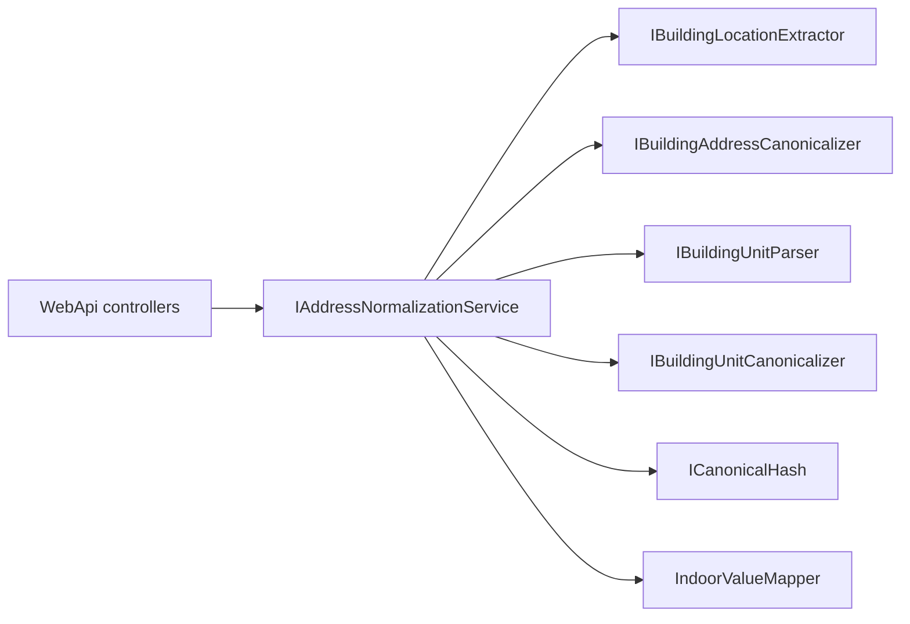

# VTBL.AddressNormalizer

Нормализация адресных данных:

1. **BuildingUnit** — локация внутри здания → structured canonical + JSON + SHA256  
2. **BuildingAddress** — полный адрес → extract outdoor/indoor + читаемый канон строения  
3. **WebApi** — HTTP API v1 поверх ядра (`AddAddressNormalizer`)

## Быстрый старт

```powershell
dotnet build VTBL.AddressNormalizer.sln
dotnet test VTBL.AddressNormalizer.sln          # 230 тестов
dotnet run --project VTBL.AddressNormalizer.Console
dotnet run --project VTBL.AddressNormalizer.Console -- address
dotnet run --project VTBL.AddressNormalizer.Console -- unit "КВАРТИРА 837"
dotnet run --project VTBL.AddressNormalizer.WebApi
```

**Console:** без аргументов — обе демо-секции; `address` / `unit` / `help`; второй аргумент — произвольная строка.

**Требования:** .NET 5.0 runtime, .NET SDK 6+ для сборки, Docker Compose (опционально, MSSQL).

## WebAPI

Подробности: [VTBL.AddressNormalizer.WebApi/README.md](VTBL.AddressNormalizer.WebApi/README.md).

| Method | Path | Назначение |
|--------|------|------------|
| POST | `/api/v1/normalize` | Полная нормализация (outdoor + indoor) |
| POST | `/api/v1/normalize/batch` | Batch той же нормализации (max `Batch:MaxItems`, default 100) |
| POST | `/api/v1/unit/normalize` | Только indoor / unit |
| POST | `/api/v1/address/extract` | Только outdoor |
| POST | `/api/v1/address/canonicalize` | Канон building location (без extract) |
| GET | `/health` | Liveness |

- Auth нет. Порт: `http://localhost:5000`. Swagger UI — только `Development` (`/swagger`).
- Вход: `{ "source": "..." }` (непустая строка; иначе 400, сообщения на русском).
- Correlation: `X-Correlation-Id` → иначе `X-Request-Id` → иначе GUID; echo в response header.
- Batch: ошибка элемента не останавливает остальные; если упали все — одна ошибка 400/500 без `items`.

### Пример ответа `POST /api/v1/normalize`

```json
{
  "source": "г Москва, ул Сухонская, д 11, кв 89",
  "value": {
    "dadataOutdoor": {
      "extracted": "г Москва, ул Сухонская, д 11",
      "outdoorCanonical": "г Москва, ул Сухонская, д 11",
      "hash": "<sha256 от outdoorCanonical>",
      "fiasId": null,
      "dadata": null
    },
    "indoorValue": {
      "hash": "<sha256 от unit canonical>",
      "apartments": { "name": "квартира", "values": ["89"] },
      "floors": { "name": "этаж", "values": [] }
    }
  }
}
```

- `dadataOutdoor.fiasId` / `dadata` в v1 всегда `null` (заглушки).
- `indoorValue.hash` — SHA256 unit-канона (`ToCanonical`); пустые категории: `values: []`.
- Unit-endpoint дополнительно отдаёт top-level `canonical` и `hash` (тот же hash, что в `indoorValue`).

## Архитектура

```
VTBL.AddressNormalizer.sln
├── Abstractions/       # контракты, BuildingUnitLocation, Logging.ILogger
├── Infrastructure/    # реализации + AddAddressNormalizer
├── Console/           # CLI-демо (DemoServices)
├── WebApi/            # HTTP host, orchestration, NLog, Swagger
└── UnitTests/         # xUnit + WebApplicationFactory
```



| Entry point | Когда |
|-------------|--------|
| HTTP `/api/v1/normalize` | Внешний доступ: outdoor + indoor |
| `IBuildingAddressNormalizer` | In-process: extract + readable canonical |
| `IBuildingLocationExtractor` | `ExtractSplit` / `Extract` |
| `IBuildingUnitParser` + `IBuildingUnitCanonicalizer` + `ICanonicalHash` | Indoor / unit: parse → canonical + SHA256 |

**Composition:** `AddAddressNormalizer()` — единый DI-граф для WebApi, Console и тестов.  
**Логирование ядра:** `Abstractions.Logging.ILogger`. Хост регистрирует реализацию через `AddAddressNormalizerLogging()` (WebApi → MEL/NLog, Console → stdout). Иначе — `NullLogger`. Debug на границе `BuildingLocationExtractor.ExtractSplit` (без полного адреса). Сообщения логов — на русском.

### In-process

```csharp
using Microsoft.Extensions.DependencyInjection;
using VTBL.AddressNormalizer.Abstractions.BuildingAddress;
using VTBL.AddressNormalizer.Infrastructure.Composition;

var services = new ServiceCollection();
services.AddAddressNormalizer();
var sp = services.BuildServiceProvider();

var result = sp.GetRequiredService<IBuildingAddressNormalizer>()
    .Normalize("г Москва, ул Сухонская, д 11, кв 89");

var split = sp.GetRequiredService<IBuildingLocationExtractor>()
    .ExtractSplit("г Москва, ул Сухонская, д 11, кв 89");
// Outdoor → "г Москва, ул Сухонская, д 11"
// Indoor  → "кв 89"
```

## Канонические префиксы (BuildingUnit)

Контракт matching — `Canonical` + `Hash`. Префиксы **не менять** без миграции данных.

| Префикс | Поле | Пример |
|---------|------|--------|
| `эт:` | floors | `эт:4` |
| `пом:` | premises | `пом:410` |
| `ком:` | rooms | `ком:35` |
| `оф:` | offices | `оф:18с` |
| `раб.м:` | workplaces | `раб.м:1` |
| `ч.п:` | parts | `ч.п:666` |
| `кв:` | apartments | `кв:837` |
| `каб:` | cabinets | `каб:69` |
| `под:` | entrances | `под:5` |
| `блок:` | blocks | `блок:1` |
| `секц:` | sections | `секц:2` |
| `а/я:` | mailboxes | `а/я:165` |
| `лит:` | literas | `лит:б` |
| `диап:` | ranges | `диап:74-82` |
| `code:` | rawCodes | `code:659318` |
| `note:` | notes | `note:вход с торца` / `note:вход с фасада` |
| `unparsed:` | unparsed | `unparsed:…` |

## Тесты

```powershell
dotnet test VTBL.AddressNormalizer.sln
```

**230** тестов (24.07.2026): BuildingUnit (parser, slash, corpus `flats.csv`, notes), BuildingAddress, composition DI, WebApi HTTP E2E.

## MSSQL (Docker, опционально)

```powershell
copy .env.example .env
docker compose up -d
```

`localhost:1435`, БД `AddressNormalizer`, user `sa`. Init: `docker/mssql/init/`.

## История изменений

### 24.07.2026 — удаление IBuildingUnitClassifier

- Удалены `IBuildingUnitClassifier`, `BuildingUnitClassifier`, `BuildingUnitCategory` и тесты
- Console-демо без CATEGORY; `IndoorMarkerPatterns` оставлены для parser/extract

### 24.07.2026 — удаление IBuildingUnitNormalizer

- Удалены `IBuildingUnitNormalizer`, `BuildingUnitNormalizer`, `BuildingUnitNormalizationResult`
- Indoor: `IBuildingUnitParser` → `IBuildingUnitCanonicalizer` → `ICanonicalHash` (оркестрация в WebApi/Console)
- Убран `Newtonsoft.Json` из Infrastructure; Console-демо без JSON

### 23.07.2026 — README актуализированы

- Корневой и WebApi README приведены к текущему контракту API (dadataOutdoor / indoorValue.hash)
- История сжата; убраны устаревшие счётчики тестов из промежуточных записей

### 23.07.2026 — DTO normalize

- `fiasId` и `dadata` внутри `dadataOutdoor` (v1 = `null`)
- `indoorValue.hash` = SHA256 unit-канона; unit endpoint сохраняет top-level `canonical`/`hash`

### 23.07.2026 — XML summary

- Однострочные `/// <summary>` → многострочный вид (Abstractions / Infrastructure / WebApi)

### 22.07.2026 — ядро и логирование

- Примечание `вход с фасада` в `NoteRegex`
- `Abstractions.Logging.ILogger` + хост-адаптеры; Debug на границах Infrastructure; тексты логов на русском
- Удалены CRM FieldAdapters; DI вместо Factory (`AddAddressNormalizer`)

### 21.07.2026 — WebApi v1 и ядро

- Endpoints normalize / batch / unit / extract / canonicalize / health
- NLog + Correlation Id; BuildingAddress / BuildingUnit; TFM `net5.0`

### 15–20.07.2026 — старт решения

- Solution, Docker/MSSQL, seed адресов
