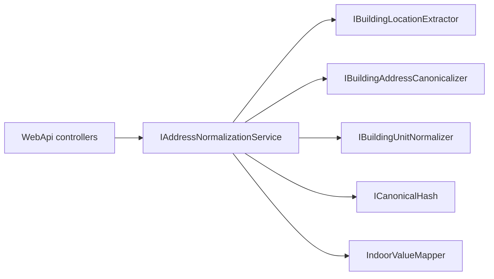

# VTBL.AddressNormalizer

Нормализация адресных данных CRM:

1. **BuildingUnit** — локация внутри здания (`new_flat`) → structured canonical + JSON + SHA256  
2. **BuildingAddress** — полный адрес → extract outdoor/indoor + читаемый канон строения  
3. **WebApi** — HTTP API v1 поверх ядра (DI: `AddAddressNormalizer`)

## Быстрый старт

```powershell
dotnet build VTBL.AddressNormalizer.sln
dotnet test VTBL.AddressNormalizer.sln          # 257 тестов
dotnet run --project VTBL.AddressNormalizer.Console
dotnet run --project VTBL.AddressNormalizer.Console -- address
dotnet run --project VTBL.AddressNormalizer.Console -- unit "КВАРТИРА 837"
dotnet run --project VTBL.AddressNormalizer.WebApi
```

**Console:** без аргументов — обе демо-секции; `address` / `unit` / `help`; второй аргумент — произвольная строка.

**Требования:** .NET 5.0 runtime, .NET SDK 6+ для сборки, Docker Compose (опционально, MSSQL).

## WebAPI

Подробности: [VTBL.AddressNormalizer.WebApi/README.md](VTBL.AddressNormalizer.WebApi/README.md).

ASP.NET Core (`net5.0`): `AddAddressNormalizer()` + `IAddressNormalizationService`, NLog (`nlog.config`, Correlation Id в layout), `ApiExceptionFilter` → 500 `{ "error": "..." }`. Auth нет. Порт по умолчанию: `http://localhost:5000`. Swagger UI — только в `Development` (`/swagger`).

| Method | Path | Назначение |
|--------|------|------------|
| POST | `/api/v1/normalize` | Полная нормализация (outdoor + indoor) |
| POST | `/api/v1/normalize/batch` | Batch той же нормализации (max `Batch:MaxItems`, default 100) |
| POST | `/api/v1/unit/normalize` | Только indoor / unit |
| POST | `/api/v1/address/extract` | Только outdoor |
| POST | `/api/v1/address/canonicalize` | Канон building location (без extract) |
| GET | `/health` | Liveness |

**Вход:** `{ "source": "..." }` (непустая строка; иначе 400).  
**Correlation:** `X-Correlation-Id` → иначе `X-Request-Id` → иначе GUID; echo в response header.  
**Batch:** ошибки по элементам не останавливают остальные; если упали все — одна ошибка 400/500 без `items`.

### Пример

```powershell
curl -X POST http://localhost:5000/api/v1/normalize `
  -H "Content-Type: application/json" `
  -H "X-Correlation-Id: smoke-demo" `
  -d "{\"source\":\"г Москва, ул Сухонская, д 11, кв 89\"}"
```

Ответ (схематично):

```json
{
  "source": "г Москва, ул Сухонская, д 11, кв 89",
  "value": {
    "fiasId": null,
    "dadataOutdoor": {
      "extracted": "г Москва, ул Сухонская, д 11",
      "outdoorCanonical": "г Москва, ул Сухонская, д 11",
      "hash": "<sha256 hex от outdoorCanonical>"
    },
    "indoorValue": {
      "apartments": { "name": "квартира", "values": ["89"] },
      "floors": { "name": "этаж", "values": [] }
    }
  }
}
```

`indoorValue` содержит все категории локации с русским `name` и массивом `values`. Сообщения ошибок API — на русском.

## Архитектура

```
VTBL.AddressNormalizer.sln
├── Abstractions/       # интерфейсы, DTO, BuildingUnitLocation
├── Infrastructure/    # реализации + AddAddressNormalizer (DI)
├── Console/           # CLI-демо (DemoServices → AddAddressNormalizer)
├── WebApi/            # HTTP host, orchestration, NLog, Swagger
└── UnitTests/         # xUnit + WebApplicationFactory
```



**Composition:** `services.AddAddressNormalizer()` — единый граф ядра для WebApi, Console и тестов.

| Entry point | Когда |
|-------------|--------|
| HTTP `/api/v1/normalize` | Внешний доступ: outdoor + indoor |
| `IBuildingAddressNormalizer` | In-process: extract + readable canonical |
| `IBuildingLocationExtractor` | `ExtractSplit` / `Extract` |
| `IBuildingUnitNormalizer` | Indoor без CRM-category |
| `ICrmNewFlatNormalizer` | Prod: поле `new_flat` (+ category) |
| `ICrmNewAddressNormalizer` | Stub, фаза 2 |

### In-process пример

```csharp
using Microsoft.Extensions.DependencyInjection;
using VTBL.AddressNormalizer.Abstractions.BuildingAddress;
using VTBL.AddressNormalizer.Infrastructure.Composition;

var services = new ServiceCollection();
services.AddAddressNormalizer();
var sp = services.BuildServiceProvider();

var result = sp.GetRequiredService<IBuildingAddressNormalizer>()
    .Normalize("г Москва, ул Сухонская, д 11, кв 89");
// Extracted / Canonical → outdoor без indoor

var split = sp.GetRequiredService<IBuildingLocationExtractor>()
    .ExtractSplit("г Москва, ул Сухонская, д 11, кв 89");
// Outdoor → "г Москва, ул Сухонская, д 11"
// Indoor  → "кв 89"
```

## Канонические префиксы (BuildingUnit)

Контракт matching — `Canonical` + `Hash`. Префиксы **не менять** без миграции данных.

| Префикс | Поле | Пример |
|---------|------|--------|
| `эт:` | floors | `эт:4` |
| `пом:` | premises | `пом:410` |
| `ком:` | rooms | `ком:35` |
| `оф:` | offices | `оф:18с` |
| `раб.м:` | workplaces | `раб.м:1` |
| `ч.п:` | parts | `ч.п:666` |
| `кв:` | apartments | `кв:837` |
| `каб:` | cabinets | `каб:69` |
| `под:` | entrances | `под:5` |
| `блок:` | blocks | `блок:1` |
| `секц:` | sections | `секц:2` |
| `а/я:` | mailboxes | `а/я:165` |
| `лит:` | literas | `лит:б` |
| `диап:` | ranges | `диап:74-82` |
| `code:` | rawCodes | `code:659318` |
| `note:` | notes | `note:…` |
| `unparsed:` | unparsed | `unparsed:…` |

## Тесты

```powershell
dotnet test VTBL.AddressNormalizer.sln
```

Покрытие: BuildingUnit (parser/slash/corpus `flats.csv`), BuildingAddress, composition DI, WebApi HTTP E2E (normalize / batch / unit / extract / canonicalize / health / Correlation Id). **257** тестов (22.07.2026).

## MSSQL (Docker, опционально)

```powershell
copy .env.example .env
docker compose up -d
```

`localhost:1435`, БД `AddressNormalizer`, user `sa`. Seed: `dbo.new_address`, `dbo.street_type`, … Init: `docker/mssql/init/`.

## История изменений

### 22.07.2026 — README переписан

- Актуальная структура: WebApi + DI (`AddAddressNormalizer`), без битых ссылок и дневника пайплайна
- Пример JSON ответа normalize; русские ошибки API; 257 тестов
- Добавлен [VTBL.AddressNormalizer.WebApi/README.md](VTBL.AddressNormalizer.WebApi/README.md)

### 22.07.2026 — DI вместо Factory

- Удалён `AddressNormalizerFactory`; composition только через `AddAddressNormalizer`
- Console (`DemoServices`) и тесты (`AddressNormalizerTestHost`) на том же DI-графе
- Русские сообщения ошибок сервиса/контроллеров/Swagger

### 21.07.2026 — WebApi v1

- Endpoints normalize / batch / unit / extract / canonicalize / health
- ExtractSplit outdoor+indoor; `dadataOutdoor` + SHA256; structured `indoorValue`
- NLog + Correlation Id; Swagger (Development) с XML и примерами

### 21.07.2026 — ядро BuildingAddress / BuildingUnit

- Abstractions + Infrastructure; CRM `new_flat`; Console-демо
- Канонические префиксы, corpus `flats.csv`, раскрытие числовых диапазонов
- TFM `net5.0` (SDK-style)

### 15–20.07.2026 — старт решения

- Solution, Docker/MSSQL, seed адресов, нормализация `new_flat`
