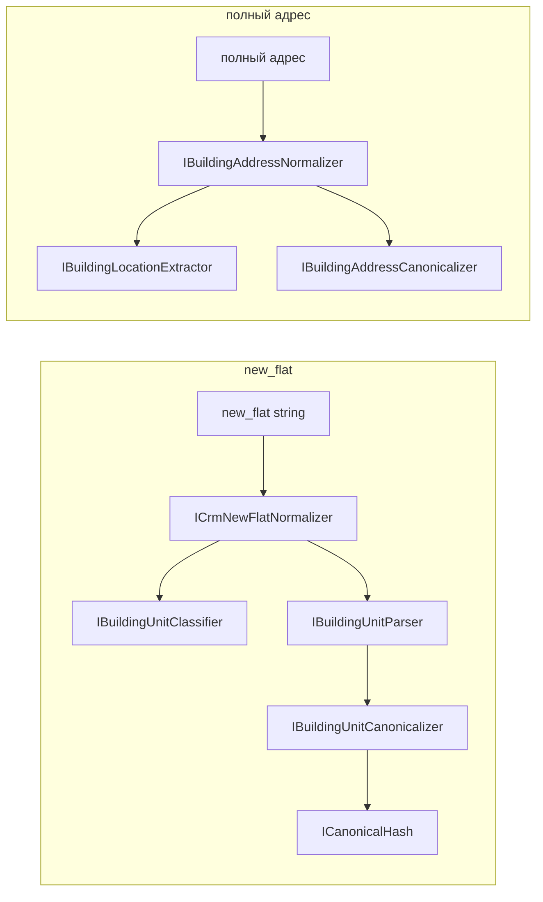

# VTBL.AddressNormalizer

Нормализация адресных данных CRM:

1. **BuildingUnit** — локация внутри здания (`new_flat`) → structured canonical + JSON + SHA256
2. **BuildingAddress** — полный адрес → extract локации здания + читаемый канон (без hash)

## Быстрый старт

```powershell
dotnet build VTBL.AddressNormalizer.sln
dotnet test VTBL.AddressNormalizer.sln          # 168+ тестов
dotnet run --project VTBL.AddressNormalizer.Console
```

**Требования:** .NET Framework `4.6.2`, совместимый .NET SDK/MSBuild для сборки SDK-style проектов, Docker Compose (для MSSQL).

## Архитектура

SOLID + разделение сборок (см. [docs/implementation/architecture_assemblies.md](docs/implementation/architecture_assemblies.md)):

```
VTBL.AddressNormalizer.sln
├── VTBL.AddressNormalizer.Abstractions/       # интерфейсы, DTO, модели
│   BuildingAddress/   IBuildingAddressNormalizer, …
│   BuildingUnit/      IBuildingUnitParser, BuildingUnitLocation, …
│   Shared/            ITextNormalizer, ICanonicalHash, SynonymRule
│   FieldAdapters/Crm/ ICrmNewFlatNormalizer, ICrmNewAddressNormalizer
│
├── VTBL.AddressNormalizer.Infrastructure/   # реализации + composition root
│   Composition/          AddressNormalizerFactory
│   BuildingAddress/      Extractor, Canonicalizer, Normalizer
│   BuildingUnit/         Parser, Classifier, Canonicalizer, Normalizer
│   Shared/               IndoorMarkerPatterns, CanonicalizationPipeline
│   FieldAdapters/Crm/    CrmNewFlatNormalizer, CrmNewAddressNormalizer (stub)
│
├── VTBL.AddressNormalizer.Console/          # тонкий хост (Program.cs)
└── VTBL.AddressNormalizer.UnitTests/
```



### Когда что вызывать

| Entry point | Когда |
|------------------|--------|
| `IBuildingAddressNormalizer` | Полный адрес: extract building location + readable canonical |
| `IBuildingLocationExtractor` | Только отсечение indoor (UC-01) |
| `IBuildingAddressCanonicalizer` | Только канонизация building location (UC-02) |
| `ICrmNewFlatNormalizer` | Prod: `new_flat` |
| `ICrmNewAddressNormalizer` | Stub: строка → BuildingAddress; сборка из полей — фаза 2 |
| `IBuildingUnitNormalizer` | Core indoor без classify |

**Composition root:** `AddressNormalizerFactory` — singleton-сервисы без DI-контейнера.

### Пример BuildingAddress

```csharp
using VTBL.AddressNormalizer.Abstractions.BuildingAddress;
using VTBL.AddressNormalizer.Infrastructure.Composition;

var normalizer = AddressNormalizerFactory.BuildingAddressNormalizer;

var result = normalizer.Normalize("г Москва, ул Сухонская, д 11, кв 89");
// result.Extracted  → "г Москва, ул Сухонская, д 11"
// result.Canonical  → "г Москва, ул Сухонская, д 11"
```

### Пример BuildingUnit / new_flat

```csharp
using VTBL.AddressNormalizer.Abstractions.FieldAdapters.Crm;
using VTBL.AddressNormalizer.Infrastructure.Composition;

var normalizer = AddressNormalizerFactory.CrmNewFlatNormalizer;

var result = normalizer.Normalize("ЭТАЖ/ПОМЕЩ. АНТРЕСОЛЬ 2/I КОМ./ОФИС 17/Е9Е");
// result.Category  → Mixed / Premise / …
// result.Canonical → "эт:антресоль 2|пом:i|ком:17|оф:е9е"
// result.Hash      → SHA256 hex
```

## Канонические префиксы (BuildingUnit)

Контракт matching — `Canonical` + `Hash`. Префиксы **не менять** без миграции данных.

| Префикс | Поле JSON | Пример |
|---------|-----------|--------|
| `эт:` | `floors` | `эт:4` |
| `пом:` | `premises` | `пом:410` |
| `ком:` | `rooms` | `ком:35` |
| `оф:` | `offices` | `оф:18с` |
| `раб.м:` | `workplaces` | `раб.м:1` |
| `ч.п:` | `parts` | `ч.п:666` |
| `кв:` | `apartments` | `кв:837` |
| `каб:` | `cabinets` | `каб:69` |
| `под:` | `entrances` | `под:5` |
| `блок:` | `blocks` | `блок:1` |
| `секц:` | `sections` | `секц:2` |
| `а/я:` | `mailboxes` | `а/я:165` |
| `лит:` | `literas` | `лит:б` |
| `диап:` | `ranges` | `диап:74-82` |
| `code:` | `rawCodes` | `code:659318` |
| `note:` | `notes` | `note:бц речной вокзал` |
| `unparsed:` | `unparsed` | `unparsed:#имя?` |

## Тесты

```powershell
dotnet test VTBL.AddressNormalizer.sln
```

| Группа | Что проверяет |
|--------|---------------|
| BuildingUnit parser / slash / normalizer | Indoor parse + canonical + hash |
| CRM `new_flat` + corpus | 5001 строк `flats.csv` |
| BuildingAddress extract / canonical / E2E | UC-01–UC-03 |
| IndoorMarkerPatterns contract | sync с BuildingUnit classifier |
| Composition | `AddressNormalizerFactory` exposes services |

**168** тестов (на 21.07.2026). Corpus gate BuildingUnit: canonical/hash не должны дрейфовать без явного решения.

## MSSQL (Docker)

```powershell
copy .env.example .env   # при необходимости
docker compose up -d
```

| Параметр | Значение |
|----------|----------|
| Хост:порт | `localhost:1435` |
| БД | `AddressNormalizer` |
| Пользователь | `sa` |

```
Server=localhost,1435;Database=AddressNormalizer;User Id=sa;Password=…;TrustServerCertificate=True;
```

### Таблицы

| Таблица | Назначение |
|---------|------------|
| `dbo.new_address` | Адреса CRM (89 seed по субъектам РФ) |
| `dbo.street_type` | Справочник типов улиц |
| `dbo.complience_address` | Соответствие адресов (заготовка) |

Ключевые столбцы `new_address`: `new_regionid`, `new_area`, `new_town`, `new_city`, `new_street`, `new_house`, `new_corp`, **`new_flat`**, `new_room`, `new_comment`, …

Init-скрипты: `docker/mssql/init/`.

## Структура решения

| Проект | TFM | Роль |
|--------|-----|------|
| `VTBL.AddressNormalizer.Abstractions` | `net462` | Интерфейсы, DTO, модели домена |
| `VTBL.AddressNormalizer.Infrastructure` | `net462` | Реализации, `AddressNormalizerFactory` |
| `VTBL.AddressNormalizer.Console` | `net462` | Тонкий хост, демо |
| `VTBL.AddressNormalizer.UnitTests` | `net462` | xUnit |
| `docker-compose.yml` | — | MSSQL 2022 + init |

## История изменений

### 21.07.2026 — отказ от Microsoft.Extensions.DependencyInjection

- Удалён `AddAddressNormalizer()` и пакеты `Microsoft.Extensions.DependencyInjection*`
- Добавлен `AddressNormalizerFactory` — composition root с lazy singleton для net462
- Console, тесты и README переведены на фабрику; из `App.config` убраны binding redirects DI
- Из `UnitTests` удалены остатки MSTest (`packages/MSTest.*`); test stack — только xUnit + `Microsoft.NET.Test.Sdk`

### 21.07.2026 — миграция из AddressNormalizer

- Перенесены все `*.cs` файлы из решения `AddressNormalizer` с сохранением структуры папок
- Namespace переименованы: `AddressNormalizer.*` → `VTBL.AddressNormalizer.*`
- README перенесён и адаптирован под `VTBL.AddressNormalizer.sln`
- `.csproj` приведены к аналогу исходного решения: PackageReference, project references, `**\*.cs`, xUnit вместо MSTest
- `App.config` Console дополнен binding redirects; `flats.csv` скопирован для corpus-тестов

### 21.07.2026 — миграция на .NET Framework 4.6.2

- Все проекты решения переведены с `net5.0` на `net462`
- Все `*.csproj` переведены на classic old-style формат без `Sdk="Microsoft.NET.Sdk"`
- `System.Text.Json` заменён на `Newtonsoft.Json` с сохранением camelCase/no-null JSON-контракта
- Из кода убраны `init`, `using var`, range/slice и другие несовместимые с `net462` конструкции
- Сборка проходит через `dotnet build`, тестовый набор проходит на `.NETFramework,Version=v4.6.2` через `dotnet vstest ...\bin\Debug\net462\VTBL.AddressNormalizer.UnitTests.dll /TestAdapterPath:...` (**168/168**)
- Для запуска `VTBL.AddressNormalizer.Console` из Visual Studio добавлен `App.config` с binding redirects и копированием транзитивных NuGet-зависимостей

### 21.07.2026 — Building Address + Abstractions/Infrastructure

- Разделение на `VTBL.AddressNormalizer.Abstractions` + `VTBL.AddressNormalizer.Infrastructure` (SOLID)
- `IBuildingAddressNormalizer`: extract indoor-хвоста + читаемая канонизация (без hash)
- Shared `IndoorMarkerPatterns` — delegate с `BuildingUnitClassifier`
- BuildingUnit / CRM `new_flat` перенесены в Infrastructure; Console — тонкий хост
- Удалён legacy `AddressCanonicalizer` (sort-char, ToHash)
- Stub `ICrmNewAddressNormalizer` для `new_address` (фаза 2)
- **168** unit-тестов; 129 BuildingUnit без дрейфа

### 15.07.2026 — инфраструктура

- Solution, Console (`net5.0`), Docker Compose + MSSQL, git
- Таблицы `new_address`, `complience_address`; seed 89 субъектов РФ

### 16.07.2026 — справочники

- `dbo.street_type`, заполнение `vtbl_streettype` в `new_address`

### 20.07.2026 — нормализация `new_flat`

**Парсер и канон**

- Pipeline: parse → canonical + JSON + SHA256
- Slash-форматы: dot-slash (`ЭТ./ПОМЕЩ.`), chain (`ЭТ/ПОМ 1/40`), compound (`XII-8`), антресоль с пробелами
- Префиксы `кв`, `каб`, `под`, `блок`, `секц`, `а/я`, `лит`, `диап`; `\` → `/`
- Corpus `flats.csv` (5001): **0** пустых canonical, ~16% `Unknown`, ~1% `unparsed:*`

**Архитектура (hard rename)**

- `IndoorLocation` + `NewFlat` → **BuildingUnit** (Core) + **FieldAdapters/Crm** (`CrmNewFlatNormalizer`)
- Единый `BuildingUnitParser`, удалён `MergeIndoorLocation`
- `NewFlatLocationKind` → `BuildingUnitCategory`; результат CRM — `Category` вместо `Kind`

**Качество**

- **129** unit-тестов; `BuildingUnitParserSlashChainTests`
- XML-doc для всех классов/методов `Canonicalization`
- README переработан под текущую архитектуру
