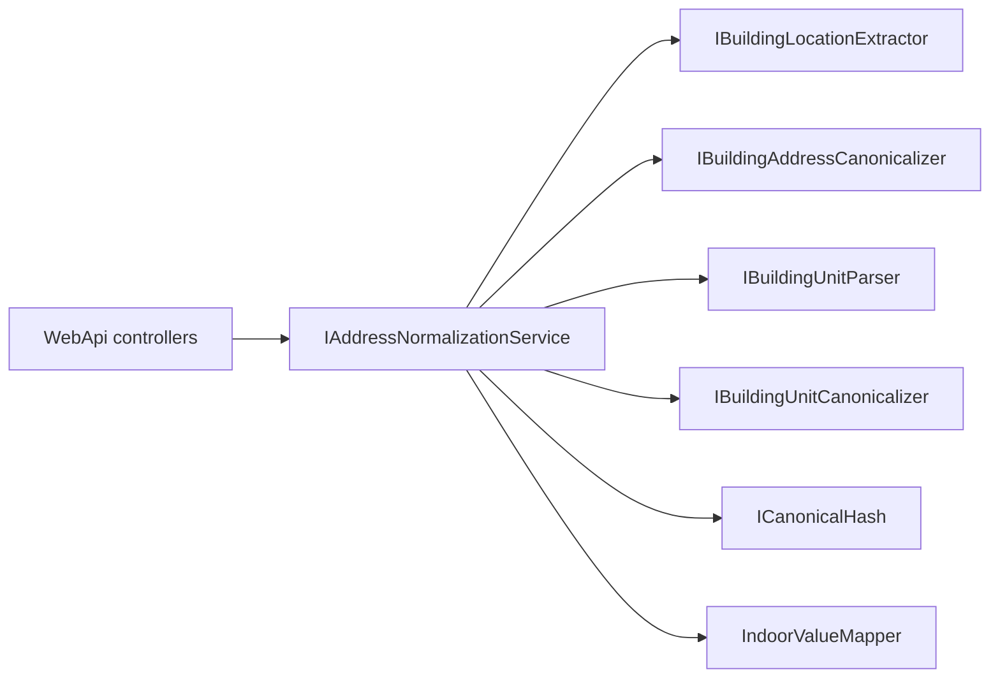

# VTBL.AddressNormalizer

Нормализация адресных данных:

1. **BuildingUnit** — локация внутри здания → structured canonical + JSON + SHA256  
2. **BuildingAddress** — полный адрес → extract outdoor/indoor + читаемый канон строения  
3. **WebApi** — HTTP API v1 поверх ядра (`AddAddressNormalizer`)

## Быстрый старт

```powershell
dotnet build VTBL.AddressNormalizer.sln
dotnet test VTBL.AddressNormalizer.sln          # 378 тестов
dotnet run --project VTBL.AddressNormalizer.Console
dotnet run --project VTBL.AddressNormalizer.Console -- address
dotnet run --project VTBL.AddressNormalizer.Console -- unit "КВАРТИРА 837"
dotnet run --project VTBL.AddressNormalizer.WebApi
```

**Console:** без аргументов — обе демо-секции; `address` / `unit` / `help`; второй аргумент — произвольная строка.

**Требования:** .NET 5.0 runtime, .NET SDK 6+ для сборки, Docker Compose (опционально, MSSQL).

## WebAPI

Подробности: [VTBL.AddressNormalizer.WebApi/README.md](VTBL.AddressNormalizer.WebApi/README.md).

| Method | Path | Назначение |
|--------|------|------------|
| POST | `/api/v1/normalize` | Полная нормализация (outdoor + indoor) |
| POST | `/api/v1/normalize/batch` | Batch той же нормализации (max `Batch:MaxItems`, default 100) |
| POST | `/api/v1/unit/normalize` | Только indoor / unit |
| POST | `/api/v1/address/extract` | Только outdoor |
| POST | `/api/v1/address/canonicalize` | Канон building location (без extract) |
| GET | `/health` | Health checks (self + readiness) |
| GET | `/health/live` | Liveness (`self`) |

- Авторизация не требуется. Порт: `http://localhost:5000`. Swagger UI доступен только в `Development` по пути `/swagger`.
- API ожидает тело вида `{ "source": "..." }`. Если поле `source` отсутствует, пустое или состоит только из пробелов, сервис вернёт `400`.
- Идентификатор запроса можно передать в заголовке `X-VTBL-Request-ID`. Если он не указан, сервис сгенерирует его автоматически и вернёт в response header.
- В batch-режиме ошибка одного элемента не останавливает обработку остальных. Если не удалось обработать весь пакет целиком, API вернёт одну общую ошибку без `items`.

### Пример ответа `POST /api/v1/normalize`

```json
{
  "source": "г Москва, ул Сухонская, д 11, кв 89",
  "value": {
    "buildingValue": {
      "extracted": "г Москва, ул Сухонская, д 11",
      "normalizedAddress": "г Москва, ул Сухонская, д 11",
      "hash": "<sha256 от normalizedAddress>",
      "fiasId": null,
      "dadata": {
        "suggest": {
          "suggestions": [
            {
              "value": "г Москва, ул Сухонская, д 11",
              "unrestricted_value": "г Москва, ул Сухонская, д 11",
              "data": { "source": "г Москва, ул Сухонская, д 11", "result": "г Москва, ул Сухонская, д 11", "country": "Россия", "country_iso_code": "RU" }
            }
          ]
        },
        "clean": {
          "source": "г Москва, ул Сухонская, д 11",
          "result": "г Москва, ул Сухонская, д 11",
          "country": "Россия",
          "country_iso_code": "RU"
        }
      }
    },
    "indoorValue": {
      "extracted": "кв 89",
      "hash": "<sha256 от unit canonical>",
      "units": [
        { "id": "apartment", "name": "квартира", "values": ["89"] }
      ]
    }
  }
}
```

- `buildingValue.fiasId` берётся из `dadata.suggest.suggestions[0].data.house_fias_id`, fallback — `dadata.clean.house_fias_id`.
- `buildingValue.dadata.suggest` / `buildingValue.dadata.clean` — типизированные заглушки под будущую интеграцию DaData.
- `indoorValue.extracted` — indoor после extract (внутренний хвост адреса).
- `indoorValue.hash` — SHA256 unit-канона (`ToCanonical`).
- `indoorValue.units` — sparse-массив категорий `{ id, name, values }`; пустые категории не включаются.
- Unit-endpoint дополнительно отдаёт top-level `canonical` и `hash` (тот же hash, что в `indoorValue`).

## Архитектура

```
VTBL.AddressNormalizer.sln
├── Abstractions/       # контракты, BuildingUnitLocation, Logging.ILogger
├── Infrastructure/    # реализации + AddAddressNormalizer
├── Console/           # CLI-демо (DemoServices)
├── WebApi/            # HTTP host, orchestration, NLog, Swagger
└── UnitTests/         # xUnit + WebApplicationFactory
```


```mermaid
flowchart LR
  HTTP["WebApi controllers"] --> SVC["IAddressNormalizationService"]
  SVC --> EXT["IBuildingLocationExtractor"]
  SVC --> CAN["IBuildingAddressCanonicalizer"]
  SVC --> PAR["IBuildingUnitParser"]
  SVC --> UCAN["IBuildingUnitCanonicalizer"]
  SVC --> HASH["ICanonicalHash"]
  SVC --> MAP["IndoorValueMapper"]
```

| Entry point | Когда |
|-------------|--------|
| HTTP `/api/v1/normalize` | Внешний доступ: outdoor + indoor |
| `IBuildingAddressNormalizer` | In-process: extract + readable canonical |
| `IBuildingLocationExtractor` | `ExtractSplit` / `Extract` |
| `IBuildingUnitParser` + `IBuildingUnitCanonicalizer` + `ICanonicalHash` | Indoor / unit: parse → canonical + SHA256 |

**Composition:** `AddAddressNormalizer()` — единый DI-граф для WebApi, Console и тестов.  
**Логирование ядра:** `Abstractions.Logging.ILogger`. Хост регистрирует реализацию через `AddAddressNormalizerLogging()` (WebApi → MEL/NLog, Console → stdout). Иначе — `NullLogger`. Debug на границе `BuildingLocationExtractor.ExtractSplit` (без полного адреса). Сообщения логов — на русском.

### In-process

```csharp
using Microsoft.Extensions.DependencyInjection;
using VTBL.AddressNormalizer.Abstractions.BuildingAddress;
using VTBL.AddressNormalizer.Infrastructure.Composition;

var services = new ServiceCollection();
services.AddAddressNormalizer();
var sp = services.BuildServiceProvider();

var result = sp.GetRequiredService<IBuildingAddressNormalizer>()
    .Normalize("г Москва, ул Сухонская, д 11, кв 89");

var split = sp.GetRequiredService<IBuildingLocationExtractor>()
    .ExtractSplit("г Москва, ул Сухонская, д 11, кв 89");
// Outdoor → "г Москва, ул Сухонская, д 11"
// Indoor  → "кв 89"
```

## Справочник regex

Полный разбор production-регулярок (лексемы, фабрика, парсер, BuildingAddress): [docs/REGEX-REFERENCE.md](docs/REGEX-REFERENCE.md).

## Канонические префиксы (BuildingUnit)

Контракт matching — `Canonical` + `Hash`. Префиксы **не менять** без миграции данных.

| Префикс | Поле | Пример |
|---------|------|--------|
| `эт:` | floors | `эт:4` |
| `пом:` | premises | `пом:410` |
| `ком:` | rooms | `ком:35` |
| `оф:` | offices | `оф:18с` |
| `раб.м:` | workplaces | `раб.м:1` |
| `ч.п:` | parts | `ч.п:666` |
| `кв:` | apartments | `кв:837` |
| `каб:` | cabinets | `каб:69` |
| `под:` | entrances | `под:5` |
| `проезд:` | passages | `проезд:1` |
| `влад:` | holdings | `влад:1` |
| `склад:` | storages | `склад:1` |
| `блок:` | blocks | `блок:1` |
| `секц:` | sections | `секц:2` |
| `а/я:` | mailboxes | `а/я:165` |
| `лит:` | literas | `лит:б` |
| `диап:` | ranges | `диап:74-82` |
| `code:` | rawCodes | `code:659318` |
| `note:` | notes | `note:вход с торца` / `note:вход с фасада` |
| `unparsed:` | unparsed | `unparsed:…` |

## Тесты

```powershell
dotnet test VTBL.AddressNormalizer.sln
```

**377** теста (24.07.2026): BuildingUnit (полное покрытие категорий parser — category/negative/gaps/slash/interleaved/corpus; римские→арабские; маркеры КО/Э/РМ; проезд/владение/склад), BuildingAddress, composition DI, WebApi HTTP E2E.

## MSSQL (Docker, опционально)

```powershell
copy .env.example .env
docker compose up -d
```

`localhost:1435`, БД `AddressNormalizer`, user `sa`. Init: `docker/mssql/init/`.

## История изменений

### 28.07.2026 — buildingValue.dadata

- Поля `suggest` и `clean` вынесены из корня `buildingValue` в объект `dadata`
- Добавлен тип `DadataDto`; контракт: `buildingValue.dadata.suggest` и `buildingValue.dadata.clean`

### 28.07.2026 — DadataOutdoorDto → BuildingValueDto

- Класс `DadataOutdoorDto` переименован в `BuildingValueDto` в соответствии с JSON-полем `buildingValue`
- Контракт API не изменился, обновлены только имена типов в коде

### 28.07.2026 — health: форматированный uptime

- В блок `service` ответа health добавлено строковое поле `uptime`
- `uptimeMs` сохранён числом для машинной обработки
- Формат `uptime`: `hh:mm:ss`, а при аптайме больше суток — `d.hh:mm:ss`

### 28.07.2026 — Swagger: верхнее описание без машинного тона

- Переписан общий `Description` Swagger-документа в `Startup.cs`
- Убраны служебные формулировки вроде `per-item`, `Auth нет`, `whitespace строка`
- Формулировки в Swagger и README синхронизированы

### 28.07.2026 — Swagger: человеческие описания

- XML-комментарии публичных endpoints и DTO в `VTBL.AddressNormalizer.WebApi` переписаны в более продуктовый тон
- Уточнены формулировки для `normalize`, `batch`, `unit`, `extract`, `canonicalize`, а также для ключевых DTO публичного JSON-контракта

### 28.07.2026 — health: версия сборки и время старта

- В JSON-ответ `GET /health` и `GET /health/live` добавлен блок `service`
- `service.assemblyVersion` берётся из сборки `VTBL.AddressNormalizer.WebApi`
- `service.startedAtUtc` и `service.uptimeMs` рассчитываются локально в `HealthCheckResponseWriter`, без протаскивания состояния через всё приложение

### 28.07.2026 — DaData snake_case и кодировка DTO

- Внутренние DTO для `buildingValue.suggest` / `buildingValue.clean` приведены к публичному контракту DaData: `snake_case` в JSON (`unrestricted_value`, `house_fias_id`, `country_iso_code`, ...)
- Swagger и README обновлены под те же ключи, чтобы документация не расходилась с реальной сериализацией
- Перезаписаны WebApi DTO-модели в корректной UTF-8 кодировке, чтобы убрать битые русские комментарии

### 28.07.2026 — DaData suggest/clean заглушки

- В `buildingValue` вместо сырого `dadata` добавлены два типизированных объекта: `suggest` и `clean`
- DTO повторяют публичную структуру ответов DaData `suggest/address` и `clean/address`
- Пока без реальных HTTP-вызовов: сервис возвращает структурные заглушки
- `buildingValue.fiasId` теперь заполняется по правилу: `suggest.house_fias_id` → `clean.house_fias_id` → `null`

### 28.07.2026 — indoorValue.units

- Поле `indoorValue.marks` переименовано в `indoorValue.units`
- Контракт, Swagger и тесты обновлены под `units`

### 27.07.2026 — IIS web.config: ASPNETCORE_ENVIRONMENT

- В `VTBL.AddressNormalizer.WebApi/web.config` задано `ASPNETCORE_ENVIRONMENT=Development` для IIS (Swagger / `IsDevelopment`)

### 27.07.2026 — indoorValue.marks (sparse)

- `IndoorValueDto`: вместо 20 typed-категорий — `marks[]` с `{ id, name, values }`
- В ответ попадают только категории с непустыми `values` (sparse)
- Стабильные id: `floor`, `apartment`, `premise`, … (`IndoorValueMapper.MarkIds`)

### 27.07.2026 — нормальный health check

- `GET /health` переведён на ASP.NET Core HealthChecks: JSON с итоговым `status` и деталями `checks`
- Добавлен `GET /health/live` (только liveness check `self`)
- Readiness-проверка валидирует `Batch:MaxItems` и делает синтетический вызов `IAddressNormalizationService`

### 27.07.2026 — заголовок X-VTBL-Request-ID

- `X-Correlation-Id` и `X-Request-Id` заменены единым заголовком `X-VTBL-Request-ID` (request + response)

### 27.07.2026 — NLog в appsettings.json

- Конфигурация NLog перенесена из `nlog.config` в секцию `NLog` файла `appsettings.json`
- Путь файловых логов: `C:\inetpub\logs\VTBL.AddressNormalizer.WebApi\webapi-*.log`

### 24.07.2026 — справочник regex

- Добавлен [docs/REGEX-REFERENCE.md](docs/REGEX-REFERENCE.md): глоссарий конструкций .NET Regex + каталог всех production-паттернов (IndoorMarkerLexemes/Factory/Patterns, BuildingUnitParser, Canonicalizer, Roman/Range, BuildingAddress, синонимы геотипов) с разбором лексем и примерами

### 24.07.2026 — голые слова → note; ShortRoom только с цифры

- Остаток ≥2 букв (не римское число) → `note:`; односимвольные и коды с цифрой — по-прежнему `code:`
- `ShortRoom` (`К`/`К.`): значение только с цифры — «Курьяновски»/«КВАРТИРНЫЙ» больше не становятся `ком:`
- Примеры: `Курьяновски` → `note:курьяновски`; `III Курьяновски` → `code:3|note:курьяновски`

### 24.07.2026 — маркеры рабочего места (РМ / Раб. место / …)

- Лексема Workplace: `РМ`, `Р.М.`, `РАБ.М`, `РАБ. МЕСТО`, `РАБ. МЕСТ`, `РАБ. МЕС` (+ точки/пробелы)
- Канон без изменений: `раб.м:`; slash-header нормализует `РМ`/`Р.М` → РАБ

### 24.07.2026 — interleaved «помещ 3/ком 4/оф 23»

- `ExtractInterleavedTypedSlash`: сегменты `маркер значение` через `/` (не путать с `ПОМ/КОМ 3/4`)
- Пример: `эт 2 помещ 3/ком 4/оф 23` → `эт:2|пом:3|ком:4|оф:23`

### 24.07.2026 — маркеры этажа «Э» / «Эт»

- `FloorMarker`: `ЭТАЖ|ЭТ|Э` (граница слова); `Эт` = `ЭТ` (IgnoreCase)
- Формы `Э 4`, `э. 2`, `Эт 2` → `эт:…`; extract/slash-header/ignorable token обновлены

### 24.07.2026 — маркер комнаты «КО»

- Лексема Room: `КОМНАТА|КОМН|КОМ|КО` (граница слова — `КОМ` не режется)
- Формы `КО 10`, `ко. 7` → `ком:10` / `ком:7`; extract/slash-header/ignorable token обновлены

### 24.07.2026 — римские номера → арабские после Parse

- `BuildingUnitRomanNumeralNormalizer`: чистый токен `I…M` → арабская строка; смеси (`X-10`, `2X`, `IA`, `XIБ`) не трогаются
- Вызов в конце `BuildingUnitParser.Parse`; Literas/Notes/Unparsed/Ranges без конвертации

### 24.07.2026 — очистка технических ID в BuildingUnit-тестах

- Убраны matrixId / GapId / UC-метки из Theory, имён методов и комментариев
- Удалён `BuildingUnitKnownGaps`; KnownGapTests — по смыслу кейса (цокол, неж.пом, секц, …)
- Решение: **330** тестов

### 24.07.2026 — полное unit-покрытие BuildingUnitParser

- Category / Negative / Slash / KnownGap / SampleCases: покрытие всех категорий локации
- Expand числовых диапазонов, соседство маркеров, early≠slash-header, фиксация известных пробелов
- Прод Parser/Canonicalizer не менялся

### 24.07.2026 — рефакторинг BuildingUnitParser (вариант C)

- Общие лексемы маркеров: `IndoorMarkerLexemes` + фабрика `IndoorMarkerRegexFactory`
- `IndoorMarkerPatterns` и early-regex парсера собраны из одних лексем
- Early-маркеры table-driven (`EarlyMarkersBefore/AfterBlockSection`); `CollapseWorking`
- Единый `ApplySlashTypeValue` для slash-chain и dot-slash

### 24.07.2026 — indoor «склад»

- Категория `Storages` / канон `склад:`; маркеры `СКЛАД`, `СКЛ.`; форма `склад 1`
- Extract: `IndoorMarkerKind.Storage`

### 24.07.2026 — indoor «владение»

- Категория `Holdings` / канон `влад:`; маркеры `ВЛАДЕНИЕ`, `ВЛАД`, `ВЛ.`; форма `владение 1`
- Extract: `IndoorMarkerKind.Holding`

### 24.07.2026 — indoor «проезд»

- Категория `Passages` / канон `проезд:`; маркеры `ПРОЕЗД`, `ПР-Д`; формы `проезд 1` и `1-й проезд`
- Extract: `IndoorMarkerKind.Passage`

### 24.07.2026 — удаление IBuildingUnitClassifier

- Удалены `IBuildingUnitClassifier`, `BuildingUnitClassifier`, `BuildingUnitCategory` и тесты
- Console-демо без CATEGORY; `IndoorMarkerPatterns` оставлены для parser/extract

### 24.07.2026 — удаление IBuildingUnitNormalizer

- Удалены `IBuildingUnitNormalizer`, `BuildingUnitNormalizer`, `BuildingUnitNormalizationResult`
- Indoor: `IBuildingUnitParser` → `IBuildingUnitCanonicalizer` → `ICanonicalHash` (оркестрация в WebApi/Console)
- Убран `Newtonsoft.Json` из Infrastructure; Console-демо без JSON

### 23.07.2026 — README актуализированы

- Корневой и WebApi README приведены к текущему контракту API (buildingValue / indoorValue.hash)
- История сжата; убраны устаревшие счётчики тестов из промежуточных записей

### 23.07.2026 — DTO normalize

 - `fiasId`, `suggest` и `clean` внутри `buildingValue` (сейчас stub-значения)
- `indoorValue.hash` = SHA256 unit-канона; unit endpoint сохраняет top-level `canonical`/`hash`

### 23.07.2026 — XML summary

- Однострочные `/// <summary>` → многострочный вид (Abstractions / Infrastructure / WebApi)

### 22.07.2026 — ядро и логирование

- Примечание `вход с фасада` в `NoteRegex`
- `Abstractions.Logging.ILogger` + хост-адаптеры; Debug на границах Infrastructure; тексты логов на русском
- Удалены CRM FieldAdapters; DI вместо Factory (`AddAddressNormalizer`)

### 21.07.2026 — WebApi v1 и ядро

- Endpoints normalize / batch / unit / extract / canonicalize / health
- NLog + Correlation Id; BuildingAddress / BuildingUnit; TFM `net5.0`

### 15–20.07.2026 — старт решения

- Solution, Docker/MSSQL, seed адресов
